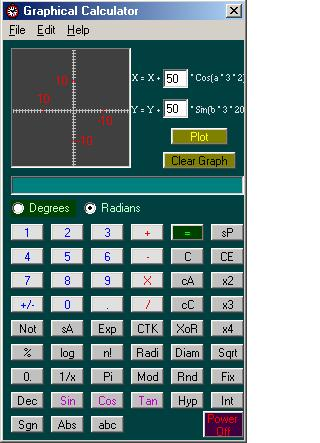



## Graphical Calculator

### Description

A graphical calculator. Many thanks to Chris Seelbach for his help. Please leave comments and vote for me if you like the program.
 
### More Info
 

             |
---                |---
**Submitted On**   |2001-04-23 16:16:10
**By**             |[Robin Thomas Benjamin McKay](https://github.com/Planet-Source-Code/PSCIndex/blob/master/ByAuthor/robin-thomas-benjamin-mckay.md)
**Level**          |Intermediate
**User Rating**    |3.7 (11 globes from 3 users)
**Compatibility**  |VB 5\.0, VB 6\.0
**Category**       |[Math/ Dates](https://github.com/Planet-Source-Code/PSCIndex/blob/master/ByCategory/math-dates__1-37.md)
**World**          |[Visual Basic](https://github.com/Planet-Source-Code/PSCIndex/blob/master/ByWorld/visual-basic.md)
**Archive File**   |[Graphical 187284232001\.zip](https://github.com/Planet-Source-Code/robin-thomas-benjamin-mckay-graphical-calculator__1-22631/archive/master.zip)

